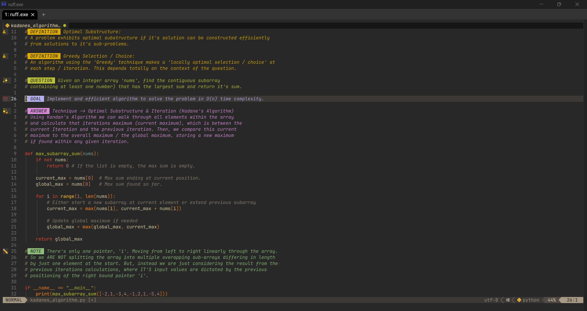
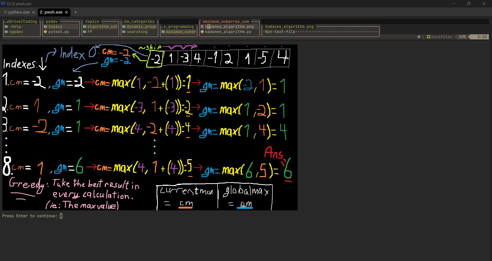

# Inspired by the 💤[LazyVim](https://github.com/LazyVim/LazyVim) neovim distro, by folke.

**
THE STACK
**

   

   
  

**GOAL:** Put multiple complex tools together to form a powerful and extensive development environment.

> **NOTE:** This is a custom project/IDE using PowerShell7/WezTerm. A work in progress that's ever changing.
> There's plans to create a compatible setup for Unix environments.

## Use Cases:

- **Studying Algorithms**:
  
- **Image Previewer**: (Studying Algorithms w/ *MS Paint*🎨)
  

  > **NOTE:** Image previewing ONLY WORKS in terminals that support the necessary image protocols, such as WezTerm, Kitty, or other compatible terminal emulators. This will **NOT** work in PowerShell, Command Prompt, or basic terminal emulators that lack support for those protocols.

- Debugging Software:
  
- Unit Testing: (Coming Soon)
- Polyglot Development w/ WezTerm Multiplexing:
  

## Language Feature Support:

| Language   | Debugging | LSP Support | TreeSitter Highlights | Linting  | Format On Save | Auto-Complete | Unit Testing |
| ---------- | --------- | ----------- | --------------------- | -------- | -------------- | ------------- | ------------ |
| MarkDown   | &#x274C;  | &#x2611;    | &#x2611;              | &#x2611; | &#x2611;       | &#x2611;      | &#x274C;     |
| Python     | &#x2611;  | &#x2611;    | &#x2611;              | &#x2611; | &#x2611;       | &#x2611;      | Soon         |
| Lua        | Limited   | &#x2611;    | &#x2611;              | &#x2611; | &#x2611;       | &#x2611;      | Soon         |
| Java       | &#x2611;  | &#x2611;    | &#x2611;              | &#x2611; | &#x2611;       | &#x2611;      | Soon         |
| Golang     | &#x2611;  | &#x2611;    | &#x2611;              | &#x2611; | &#x2611;       | &#x2611;      | Soon         |
| JavaScript | &#x2611;  | &#x2611;    | &#x2611;              | &#x2611; | &#x2611;       | &#x2611;      | Soon         |
| TypeScript | &#x2611;  | &#x2611;    | &#x2611;              | &#x2611; | &#x2611;       | &#x2611;      | Soon         |
| C#         | &#x2611;  | &#x2611;    | &#x2611;              | &#x2611; | &#x2611;       | &#x2611;      | Soon         |
| C++        | &#x2611;  | &#x2611;    | &#x2611;              | &#x2611; | &#x2611;       | &#x2611;      | Soon         |
| PowerShell | &#x274C;  | &#x2611;    | &#x2611;              | &#x2611; | &#x2611;       | &#x2611;      | &#x274C;     |

## Setup:

This setup does require some knowledge of powershell profiles for correctly setting environment variables
(_used during open powershell sessions_), or you could just set them within the global table on windows.

### Environment Variables (Profile Specific)

This config is intended to demonstrate that it's possible to have multiple language support within neovim.
In order for these languages to work, there are a few pre-requisites that need to be in place prior to utilisation.

| Variable                        | Description                                               | Why?                                                                                                                                                        |
| ------------------------------- | --------------------------------------------------------- | ----------------------------------------------------------------------------------------------------------------------------------------------------------- |
| `JAVA_HOME`                     | Path to Java installation directory.                      | Java 21 required as 'JAVA_HOME' for nvim-jdtls to function. This variable points to the JDK itself, providing programs the java tools required to function. |
| `DOTNET_ROOT`                   | .NET SDK root directory.                                  | .NET6.0 SDK / Runtime required for the OmniSharp LSP support within NeoVim. The latest that can be used is version 8.\*.\*                                  |
| `CMAKE_EXPORT_COMPILE_COMMANDS` | Specifies default CMake generator.                        | We need to tell the 'Ninja' generator to create instructions for the 'clangd' LSP. It details how C++ projects are structured.                              |
| `CMAKE_BUILD_TYPE`              | Specifies build type for CMake (e.g., Debug/Release).     | Change this between 'Debug' or 'Release' depending on whether or not you want to include debug symbols for debugging using nvim-dap in C++ projects.        |
| `CMAKE_BUILD_GENERATOR`         | Specifies the generator to be used for the build process. | Ninja is one generator that is compatible with neovim.                                                                                                      |

> **NOTE:** **'CMAKE_BUILD_GENERATOR'** should only be specified within any 'CMakeLists.txt' files you have within your C++ projects. In case your using other IDEs like Visual Studio too.

### Global Environment Variables:

Some environment Variables are required to exposed to the OS at all times. For example, if you're
using the WezTerm Multiplexer (MUX), it won't be able to see the variables you've set within your terminal
profiles, <u>**only those that are global and set via your system settings**.</u>

| Variable               | Description                                        | Why?                                                                                                                                                                                                                                                                                                                                                                                                                                                                                                                     |
| ---------------------- | -------------------------------------------------- | ------------------------------------------------------------------------------------------------------------------------------------------------------------------------------------------------------------------------------------------------------------------------------------------------------------------------------------------------------------------------------------------------------------------------------------------------------------------------------------------------------------------------ |
| `$WEZTERM_CONFIG_FILE` | Path to '.wezterm.lua' config file. (NOT IN $PATH) | The 'wezterm.exe' process must be able to access its configuration file before it initializes. Since WezTerm is responsible for launching the shell or terminal program specified in 'config.default_prog' and 'config.launch_menu', the configuration needs to be available globally. Not just within a shell profile like '.bashrc' or 'profile.ps1'. If the '$WEZTERM_CONFIG_FILE' variable is only set in a shell profile, it won't be recognised when WezTerm starts, as the shell itself hasn't been launched yet. |

> **NOTE:** It's important that these variables are set correctly and in the right way so WezTerm
> can see it's configuration and use any custom preferences you've set within your '.wezterm.lua' file.

### **Required executables to add to the "$PATH" variable:**

Considering the scope and ambitious versatility of this configuration project, there's alot of programs that need to be
exposed to the Windows OS via either a powershell profile, or your global environment variables table accessible via the windows settings.
This allows for these programs to be used by plugins in neovim, allowing them to work as intended.

| Executable                       | Description                                                                                                                 | Why?                                                                                                                                                                                                                                                                                                   |
| -------------------------------- | --------------------------------------------------------------------------------------------------------------------------- | ------------------------------------------------------------------------------------------------------------------------------------------------------------------------------------------------------------------------------------------------------------------------------------------------------ |
| `nvim.exe`                       | Neovim                                                                                                                      | <u>_This project is based around this lightweight text editor._</u>                                                                                                                                                                                                                                    |
| `oh-my-posh.exe`                 | Oh My Posh                                                                                                                  | Make your terminal look nice.                                                                                                                                                                                                                                                                          |
| eg: `clangd.cmd`, `codelldb.cmd` | Neovim's Mason Plugin Manager, plugins.                                                                                     | Required to be 'findable' by other plugins mentioned within this config.                                                                                                                                                                                                                               |
| `pwsh.exe`                       | PowerShell7. (<u>Use **GLOBAL** Path</u>)                                                                                   | Required for WezTerm terminal emulator to properly execute PowerShell 7 commands and scripts.                                                                                                                                                                                                          |
| `py.exe`                         | Python Launcher.                                                                                                            | Program that uses the latest version of python installed on your system.                                                                                                                                                                                                                               |
| eg: `pip.exe`                    | 'Scripts' directory of every python version you have installed on your system.                                              | These directories contain the corresponding modules required by that specific version of python. <u>_And that version of python could be a dependency of another part of the system._</u>                                                                                                              |
| `lua5.1.exe & luarocks.exe`      | Lua V5.1 interpreter, and it's package manager.                                                                             | Most compatible version of the lua interpreter for neovim plugin build processes, along with it's package manager, luarocks.                                                                                                                                                                           |
| `java.exe`                       | Java JDK installation ($JAVA_HOME).                                                                                         | Java Develpment Kit (JDK) containing the The Java compiler for compiling java code to an intermediaery language (IL) / byte code, and then the Java Virtual Machine (JVM) for running that byte code (your java program).                                                                              |
| `gradle.exe`                     | Gradle build tool.                                                                                                          | Gradle Build System for automating the creation, compilation, and packaging of Java projects using a **_compatible_** version of the JDK.                                                                                                                                                              |
| `node.exe`                       | Node.js runtime                                                                                                             | The Node.js Runtime allows for the execution of JavaScript code outside of a browser. It utilises Google Chrome's V8 engine for this. It's required for JavaScript & TypeScript-based Neovim plugin support.                                                                                           |
| `npm.exe`                        | Node.js' package manager                                                                                                    | Handles package management for JavaScript/TypeScript dependencies. Required for building and installing _some_ Neovim plugins.                                                                                                                                                                         |
| eg: `tsc.cmd`, `npx.cmd`         | Global 'node_modules' directory.                                                                                            | Required for accessing global node modules, such as 'tsc', a transpiler for converting TypeScript to JavaScript code. Or, 'npx' the node package runner which can execute Node.js packages without globally installing them (used by certain Neovim plugins that rely on temporary package execution). |
| `dotnet.exe`                     | .NET SDK CLI tool.                                                                                                          | Allows for creating, building, testing and publishing .NET applications. Required for C# language support.                                                                                                                                                                                             |
| `OmniSharp.exe`                  | .NET LSP.                                                                                                                   | Required for C# support.                                                                                                                                                                                                                                                                               |
| `g++.exe`                        | GNU C++ compiler.                                                                                                           | Required for compiling C++ code.                                                                                                                                                                                                                                                                       |
| `cargo.exe & rustc.exe`          | Rust's Build System / Package Manager & the Rust Compiler.                                                                  | Required for rust language support and for building rust based plugins and compiling treesitter language grammars.                                                                                                                                                                                     |
| `lldb.exe`                       | C++ Debugger.                                                                                                               | Required by 'nvim-dap' plugin within neovim for debugging C++ code.                                                                                                                                                                                                                                    |
| `cmake.exe`                      | CMake cross platform 'Meta' build system generator. It makes build ('instruction') files for other build systems to follow. | Required for managing the build process in a compiler-independent manner, when building complex C & C++ projects.                                                                                                                                                                                      |
| `ninja.exe`                      | Ninja build system for C++ projects.                                                                                        | Required by CMake for building C++ projects, and for supporting the when using the 'clangd' LSP by providing 'compile_commands.json' files.                                                                                                                                                            |
| `go.exe & delve.exe`             | Golang & Go 'Delve' Debug Adapter.                                                                                          | Required for go support and debugging golang code using 'nvim-dap'.                                                                                                                                                                                                                                    |
