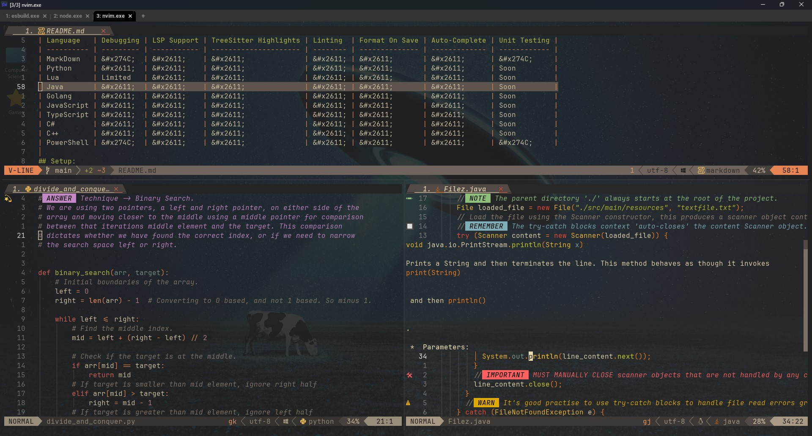

# Inspired by the 💤[LazyVim](https://github.com/LazyVim/LazyVim) neovim distro, by folke.

**
THE STACK
**

   

   
  

**GOAL:** Put multiple complex tools together to form a powerful and extensive development environment.

> **NOTE:** This is a custom project/IDE using PowerShell7/WezTerm. A work in progress that's ever changing.
> There's plans to create a compatible setup for Unix environments.

## Use Cases:

### Examples:

- **Studying Algorithms**:
  
- **Image Previewer**: (Studying Algorithms w/ *MS Paint*🎨)
  

  > **NOTE:** Image previewing ONLY WORKS in terminals that support the necessary image protocols, such as WezTerm, Kitty, or other compatible terminal emulators. This will **NOT** work in PowerShell, Command Prompt, or basic terminal emulators that lack support for those protocols.

- Debugging Software:
  
- Unit Testing: ??? (Coming Soon)
- Polyglot Development w/ WezTerm Multiplexing:
  

## Language Feature Support:

| Language   | Debugging | LSP Support | TreeSitter Highlights | Linting  | Format On Save | Auto-Complete | Unit Testing |
| ---------- | --------- | ----------- | --------------------- | -------- | -------------- | ------------- | ------------ |
| MarkDown   | &#x274C;  | &#x2611;    | &#x2611;              | &#x2611; | &#x2611;       | &#x2611;      | &#x274C;     |
| Python     | &#x2611;  | &#x2611;    | &#x2611;              | &#x2611; | &#x2611;       | &#x2611;      | ?            |
| Lua        | Limited;  | &#x2611;    | &#x2611;              | &#x2611; | &#x2611;       | &#x2611;      | ?            |
| Java       | &#x2611;  | &#x2611;    | &#x2611;              | &#x2611; | &#x2611;       | &#x2611;      | ?            |
| Golang     | &#x2611;  | &#x2611;    | &#x2611;              | &#x2611; | &#x2611;       | &#x2611;      | ?            |
| JavaScript | &#x2611;  | &#x2611;    | &#x2611;              | &#x2611; | &#x2611;       | &#x2611;      | ?            |
| TypeScript | &#x2611;  | &#x2611;    | &#x2611;              | &#x2611; | &#x2611;       | &#x2611;      | ?            |
| C#         | &#x2611;  | &#x2611;    | &#x2611;              | &#x2611; | &#x2611;       | &#x2611;      | ?            |
| C++        | &#x2611;  | &#x2611;    | &#x2611;              | &#x2611; | &#x2611;       | &#x2611;      | ?            |
| PowerShell | &#x274C;  | &#x2611;    | &#x2611;              | &#x2611; | &#x2611;       | &#x2611;      | &#x274C;     |

## Setup:

This setup does require some knowledge of powershell profiles for correctly setting environment variables
(_used during open powershell sessions_), or you could just set them within the global table on windows.

### Environment Variables (Profile Specific)

This config is intended to demonstrate that it's possible to have multiple language support within neovim.
In order for these languages to work, there are a few pre-requisites that need to be in place prior to utilisation.

| Variable                        | Description                                           | Why? |
| ------------------------------- | ----------------------------------------------------- | ---- |
| `JAVA_HOME`                     | Path to Java installation directory.                  |      |
| `DOTNET_ROOT`                   | .NET SDK root directory.                              |      |
| `CMAKE_EXPORT_COMPILE_COMMANDS` | Specifies default CMake generator.                    |      |
| `CMAKE_BUILD_TYPE`              | Specifies build type for CMake (e.g., Debug/Release). |      |

### Global Environment Variables:

Some environment Variables are required to exposed to the OS at all times. For example, if you're
using the WezTerm Multi-plexer, it won't be able to see the variables you've set within your terminal
profiles, <u>**only those that are global and set via your system settings**.</u>

| Variable               | Description                                        | Why? |
| ---------------------- | -------------------------------------------------- | ---- |
| `$WEZTERM_CONFIG_FILE` | Path to '.wezterm.lua' config file. (NOT IN $PATH) |      |

> **NOTE:** It's important that these variables are set correctly and in the right way so WezTerm
> can see it's configuration and use any custom preferences you've set within your '.wezterm.lua' file.

### **Required executables to add to the "$PATH" variable:**

Considering the scope and ambitious versatility of this configuration project, there's alot of programs that need to be
exposed to the Windows OS via either a powershell profile, or your global environment variables table accessible via the windows settings.
This allows for these programs to be used by plugins in neovim, allowing them to work as intended.

| Executable                   | Description                                                                         | Why? |
| ---------------------------- | ----------------------------------------------------------------------------------- | ---- |
| `powershell7.exe / pwsh.exe` | Path to your PowerShell7 executable. (NOT IN PROFILE, **GLOBALLY**) - _for WezTerm_ |      |
| `python`                     | Python interpreter.                                                                 |      |
| `py`                         | Python Launcher.                                                                    |      |
| `pip`                        | Python package manager.                                                             |      |
| `lua`                        | Lua interpreter.                                                                    |      |
| `luarocks`                   | Lua package manager.                                                                |      |
| `java`                       | Java runtime.                                                                       |      |
| `javac`                      | Java compiler.                                                                      |      |
| `mvn`                        | Apache Maven (Java build tool).                                                     |      |
| `gradle`                     | Gradle build tool.                                                                  |      |
| `node.js`                    | Node.js runtime required for JavaScript support.                                    |      |
| `npm`                        | Node.js package manager required for building _some_ plugins.                       |      |
| `npx`                        | Node.js package runner.                                                             |      |
| `tsc`                        | TypeScript compiler (from npm).                                                     |      |
| `dotnet`                     | .NET SDK CLI tool.                                                                  |      |
| `msbuild`                    | Microsoft build system for .NET.                                                    |      |
| `g++`                        | GNU C++ compiler.                                                                   |      |
| `clang++`                    | Clang C++ compiler.                                                                 |      |
| `cmake`                      | CMake build system.                                                                 |      |
| `make`                       | Make build automation tool.                                                         |      |
