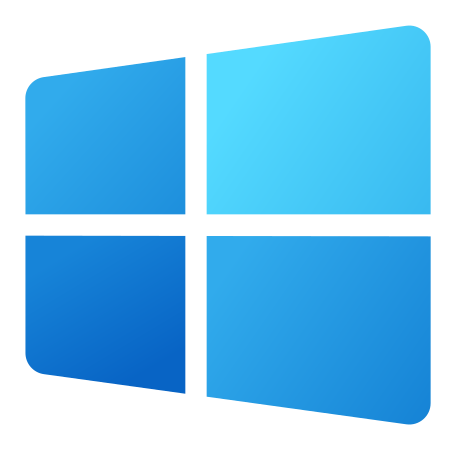
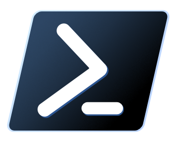

# 
Inspired by the _💤[LazyVim](https://github.com/LazyVim/LazyVim)_ distro.

## **
Preview:
**

## **
The Stack:
**

    
     
    
     
    
     
    
     
    

> **NOTE:** This is a custom configuration project meant to mimick typical IDEs, using PowerShell7/WezTerm. It's a work
> in progress. <u>_I'm hoping to cover Unix system settings at some point._</u>

**GOAL:** To put multiple complex tools together to form a powerful and extensive development environment.

> **PAIN POINTS**: \_<u>A list of mistakes I've made, and how to avoid them.</u>
>
> - <u>_'File is too large to open' (mini.files)_</u>: If the file is currently stored
>   on your OneDrive, please ensure your OneDrive is running and synced so you
>   actually have the file locally on your machine, to open it.
> - <u>_'Snacks terminal not opening in the same directory as the current buffer' (snacks.nvim)_</u>: The terminal
>   provided by the snacks.nvim package (<u>_triggered via the keybind 'CTRL + /'_</u>) will open in the same directory
>   where you initially entered neovim. I've added a which-key keybind to allow you
>   set the current directory to the parent directory of the current buffer, use '\<leader> + \\'. Then when you enter
>   the snacks terminal, it'll open in the same directory as the current buffer, without having to first exit and re-enter
>   neovim in that desired directory.

## Use Cases:

- **Work on Projects (eg: _React + Ts /w Vite_)**: (<u>_More frameworks & libraries can be supported_</u>)
  

- **Study Algorithms w/ WezTerm Multiplexing**: (_<u>Image Previewer included</u>_)
  

  > **NOTE:** Image previewing ONLY WORKS in terminals that support the necessary image protocols, such as WezTerm, Kitty, or other compatible terminal emulators. This will **NOT** work in PowerShell, Command Prompt, or basic terminal emulators that lack support for those protocols.

- **Debug Software w/ Nvim-Dap:**
  
- **Use Polyglot Development w/ WezTerm Multiplexing:**
  
- **Unit Testing**: (<u>_Multiple Frameworks supported_</u>)

## Language Feature Support:

| Language   | Debugging | LSP Support | TreeSitter Highlights | Linting  | Format On Save | Auto-Complete |
| ---------- | --------- | ----------- | --------------------- | -------- | -------------- | ------------- |
| MarkDown   | &#x274C;  | &#x2611;    | &#x2611;              | &#x2611; | &#x2611;       | &#x2611;      |
| Python     | &#x2611;  | &#x2611;    | &#x2611;              | &#x2611; | &#x2611;       | &#x2611;      |
| Lua        | Limited   | &#x2611;    | &#x2611;              | &#x2611; | &#x2611;       | &#x2611;      |
| Java       | &#x2611;  | &#x2611;    | &#x2611;              | &#x2611; | &#x2611;       | &#x2611;      |
| Golang     | &#x2611;  | &#x2611;    | &#x2611;              | &#x2611; | &#x2611;       | &#x2611;      |
| JavaScript | &#x2611;  | &#x2611;    | &#x2611;              | &#x2611; | &#x2611;       | &#x2611;      |
| TypeScript | &#x2611;  | &#x2611;    | &#x2611;              | &#x2611; | &#x2611;       | &#x2611;      |
| C#         | &#x2611;  | &#x2611;    | &#x2611;              | &#x2611; | &#x2611;       | &#x2611;      |
| C++        | &#x2611;  | &#x2611;    | &#x2611;              | &#x2611; | &#x2611;       | &#x2611;      |
| PowerShell | &#x274C;  | &#x2611;    | &#x2611;              | &#x2611; | &#x2611;       | &#x2611;      |

## Testing Framework Support: (_<u>via neotest</u>_)

| Framework  | Adapter Support |
| ---------- | --------------- |
| Playwright | &#x2611;        |
| Jest       | &#x274C;        |

I plan on adding as many useful frameworks as possible.

## Setup:

All can be setup in the following steps:

1. Use a windows package manager of your choice (_i.e.: <u>winget</u> or <u>chocolatey</u>_) to install NeoVim onto your system.
2. Clone or fork this repository to make it your own, into your '_C:\Users\<Username>\AppData\Local_' directory. (Overwrite the 'nvim' directory if it exists already after following step **1**)
3. Install the following software, and configure the following environment variables <u>_exactly_</u> as is to complete the setup.

> **NOTE**: This setup does require some knowledge of powershell profiles for correctly setting environment variables
> (_used during open powershell sessions_), _**OR**_ _you could just set them within the global environment table
> on windows_ ~<u>_NOT AS CLEAN_</u>.

### Environment variables (_Profile Specific_):

You can have multiple programming languages supported within neovim. However, in order for these languages to work, there are a few pre-requisites
that need to be in place prior to utilisation. Following is a table of environment variables that must be set to the correct values
(_<u>paths to particular pieces of software</u>_) in accordance to the intended plugins specifications. The plugins themselves dictate
what versions of these software components are depended on in order to work correctly. So, in case of any updates to these plugin specs,
please read them again in case of any changes being made to these dependencies.

| Variable                             | Description                                               | Why?                                                                                                                                                        |
| ------------------------------------ | --------------------------------------------------------- | ----------------------------------------------------------------------------------------------------------------------------------------------------------- |
| `$env:JAVA_HOME`                     | Path to Java installation directory.                      | Java 21 required as 'JAVA_HOME' for nvim-jdtls to function. This variable points to the JDK itself, providing programs the java tools required to function. |
| `$env:DOTNET_ROOT`                   | .NET SDK root directory.                                  | .NET6.0 SDK / Runtime required for the OmniSharp LSP support within NeoVim. The latest that can be used is version 8.\*.\*                                  |
| `$env:CMAKE_EXPORT_COMPILE_COMMANDS` | Specifies default CMake generator.                        | We need to tell the 'Ninja' generator to create instructions for the 'clangd' LSP. It details how C++ projects are structured.                              |
| `$env:CMAKE_BUILD_TYPE`              | Specifies build type for CMake (e.g., Debug/Release).     | Change this between 'Debug' or 'Release' depending on whether or not you want to include debug symbols for debugging using nvim-dap in C++ projects.        |
| `$env:CMAKE_BUILD_GENERATOR`         | Specifies the generator to be used for the build process. | Ninja is one build generator that is compatible with neovim.                                                                                                |

> **NOTE:** **'CMAKE_BUILD_GENERATOR'** should only be specified within any 'CMakeLists.txt' files you have within your C++ projects. In case your using other IDEs like Visual Studio too.

### Global environment variables:

Some environment Variables are required to be exposed to the OS at all times. For example, if you're
using the WezTerm Multiplexer (MUX), it will NOT be able to see the variables you've set within your terminal profile. <u>**It can only view those that are set within the global table, via your system settings.**</u>

| Variable               | Description                                             | Why?                                                                                                                                                                                                                                                                                                                                                                                                                                                                                                        |
| ---------------------- | ------------------------------------------------------- | ----------------------------------------------------------------------------------------------------------------------------------------------------------------------------------------------------------------------------------------------------------------------------------------------------------------------------------------------------------------------------------------------------------------------------------------------------------------------------------------------------------- |
| `$WEZTERM_CONFIG_FILE` | Path to '.wezterm.lua' config file. (Seperate to $PATH) | The 'wezterm.exe' process must be able to access its configuration file before it initializes. Since WezTerm is responsible for launching the shell or terminal program specified in 'config.default_prog' and 'config.launch_menu', the configuration needs to be available globally. Not just within a shell profile like (profile.ps1). If the '$WEZTERM_CONFIG_FILE' variable is only set in a shell profile, it won't be recognised when WezTerm starts, as the shell itself hasn't been launched yet. |
| `path\to\pwsh.exe`     | Path to 'pwsh.exe'. (Included in $PATH)                 | Required for WezTerm terminal emulator to properly execute PowerShell 7 commands and scripts.                                                                                                                                                                                                                                                                                                                                                                                                               |

> **NOTE:** It's important that these variables are set correctly and in the right way so WezTerm
> can see it's configuration and use any custom preferences you've set within your '.wezterm.lua' config file.

### **Executables to add to "_$PATH_":**

Considering the scope of this '_configuration_' project, there is a lot of programs that need to be
exposed to the OS. Either via a powershell profile, or the global environment variables table (_accessible via your system settings_).
Plugins will then be able to access and utilise these programs within neovim, allowing them to function as intended. Why do I suggest exposing them via
a profile instead of global table? To keep your global environment variables table tidy, as it should only be used for programs that are required system wide.

| Executable                       | Description                                                                                                                 | Why?                                                                                                                                                                                                                                                                                                   |
| -------------------------------- | --------------------------------------------------------------------------------------------------------------------------- | ------------------------------------------------------------------------------------------------------------------------------------------------------------------------------------------------------------------------------------------------------------------------------------------------------ |
| `nvim.exe`                       | Neovim                                                                                                                      | <u>_This project is based around this lightweight text editor._</u>                                                                                                                                                                                                                                    |
| `oh-my-posh.exe`                 | Oh My Posh                                                                                                                  | Make your terminal look nice.                                                                                                                                                                                                                                                                          |
| eg: `clangd.cmd`, `codelldb.cmd` | Neovim's Mason Plugin Manager, plugins.                                                                                     | Required to be 'findable' by other plugins mentioned within this config.                                                                                                                                                                                                                               |
| `py.exe`                         | Python Launcher.                                                                                                            | Program that uses the latest version of python installed on your system.                                                                                                                                                                                                                               |
| eg: `pip.exe`                    | 'Scripts' directory of every python version you have installed on your system.                                              | These directories contain the corresponding modules required by that specific version of python. <u>_And that version of python could be a dependency of another part of the system._</u>                                                                                                              |
| `lua5.1.exe & luarocks.exe`      | Lua V5.1 interpreter, and it's package manager.                                                                             | Most compatible version of the lua interpreter for neovim plugin build processes, along with it's package manager, luarocks.                                                                                                                                                                           |
| `java.exe`                       | Java JDK installation ($JAVA_HOME).                                                                                         | Java Develpment Kit (JDK) containing the The Java compiler for compiling java code to an intermediaery language (IL) / byte code, and then the Java Virtual Machine (JVM) for running that byte code (your java program).                                                                              |
| `gradle.exe`                     | Gradle build tool.                                                                                                          | Gradle Build System for automating the creation, compilation, and packaging of Java projects using a **_compatible_** version of the JDK.                                                                                                                                                              |
| `node.exe`                       | Node.js runtime                                                                                                             | The Node.js Runtime allows for the execution of JavaScript code outside of a browser. It utilises Google Chrome's V8 engine for this. It's required for JavaScript & TypeScript-based Neovim plugin support.                                                                                           |
| `npm.exe`                        | Node.js' package manager                                                                                                    | Handles package management for JavaScript/TypeScript dependencies. Required for building and installing _some_ Neovim plugins.                                                                                                                                                                         |
| eg: `tsc.cmd`, `npx.cmd`         | Global 'node_modules' directory.                                                                                            | Required for accessing global node modules, such as 'tsc', a transpiler for converting TypeScript to JavaScript code. Or, 'npx' the node package runner which can execute Node.js packages without globally installing them (used by certain Neovim plugins that rely on temporary package execution). |
| `dotnet.exe`                     | .NET SDK CLI tool.                                                                                                          | Allows for creating, building, testing and publishing .NET applications. Required for C# language support.                                                                                                                                                                                             |
| `OmniSharp.exe`                  | .NET LSP.                                                                                                                   | Required for C# support.                                                                                                                                                                                                                                                                               |
| `g++.exe`                        | GNU C++ compiler.                                                                                                           | Required for compiling C++ code.                                                                                                                                                                                                                                                                       |
| `cargo.exe & rustc.exe`          | Rust's Build System / Package Manager & the Rust Compiler.                                                                  | Required for rust language support and for building rust based plugins and compiling treesitter language grammars.                                                                                                                                                                                     |
| `lldb.exe`                       | C++ Debugger.                                                                                                               | Required by 'nvim-dap' plugin within neovim for debugging C++ code.                                                                                                                                                                                                                                    |
| `cmake.exe`                      | CMake cross platform 'Meta' build system generator. It makes build ('instruction') files for other build systems to follow. | Required for managing the build process in a compiler-independent manner, when building complex C & C++ projects.                                                                                                                                                                                      |
| `ninja.exe`                      | Ninja build system for C++ projects.                                                                                        | Required by CMake for building C++ projects, and for supporting the when using the 'clangd' LSP by providing 'compile_commands.json' files.                                                                                                                                                            |
| `go.exe & delve.exe`             | Golang & Go 'Delve' Debug Adapter.                                                                                          | Required for go support and debugging golang code using 'nvim-dap'.                                                                                                                                                                                                                                    |

### **Luarocks modules / rocks (<u>_packages/libraries_</u>) support:**

Luarocks is a native lua package manager. You can download and use modules to make life a little easier both within a Neovim and/or a Wezterm context.

<u>_What do I mean by this?_</u>

I mean that it's possible to install luarock modules within Neovim's configuration directory hierarchy, and also allow Wezterm to '_see_' those modules so it too can use them.
This project is configured in this exact way. The surrounding WezTerm application / process is '_pointed to_' the this install path. _This was purely by choice to keep everything
as tightly bundled together as possible_. So, you can easily navigate to the same directory to make changes to rocks you've installed, and this will affect both NeoVim and WezTerm
(_at least in terms of what luarock modules they 'see' at runtime_).

_**<u>Steps to configure:</u>**_

1. Download the lua package via chocolatey (<u>_this will **ALSO** include luarocks_</u>).
   > _Note_: Chocolotey installs a windows compatible version of lua (v5.1), and luarocks.
   > A 'luarocks' folder will be created within the 'ProgramData' directory in your C: drive.
   > LuaRocks uses this directory as part of it's runtime configuration.
2. Create a file called 'config.lua' file within that 'luarocks' directory.
3. Type the following snippet into that 'config.lua' file:

> _Note_: This path should be later added to the runtimepath (rtp) for both your Neovim and Wezterm application instances, so both can look into this directory to be able to '<u>_require_</u>' modules installed via luarocks.

4. Point the luarocks package manager to it's intended configuration file, by setting the $env:LUAROCKS_CONFIG environment variable within your powershell profile.

That's it, you should now be able to require modules both within a Neovim or Wezterm application runtime context.

> _Note_: When using the 'luarocks install' command, you **MUST** use the '--tree' parameter to specify the name of the root you wish to access, in order to install the plugin there. 'system' is the default, and is considered '_system-wide_', and is handled by chocolatey.
