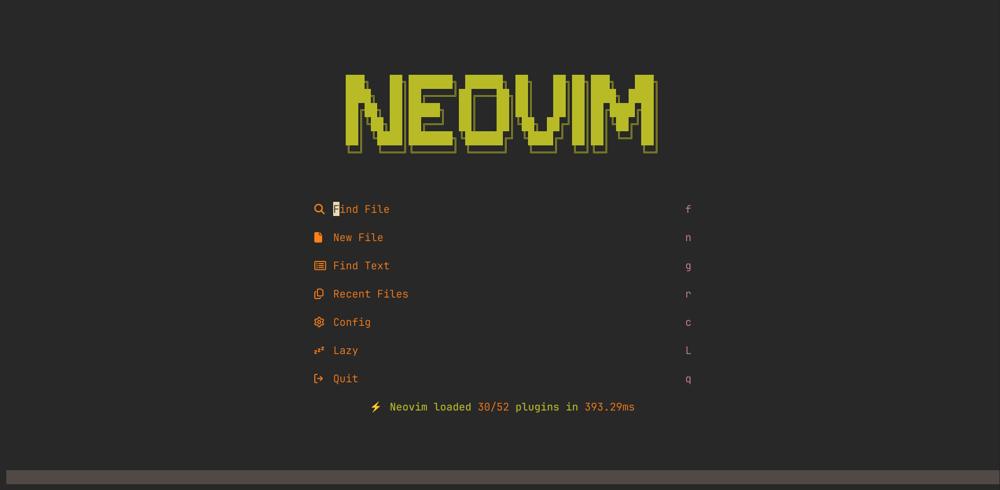
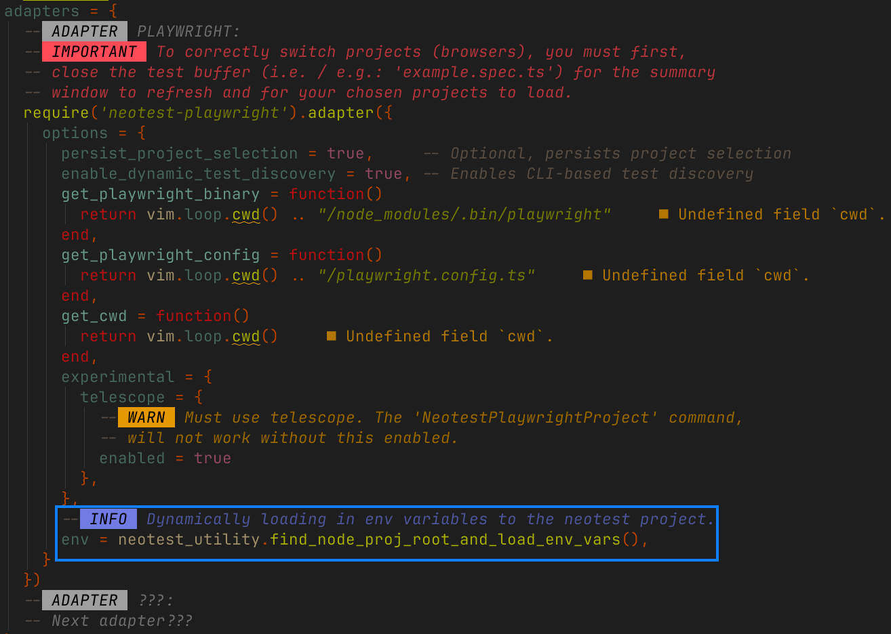

# <p align="center">Inspired by the _:zzz: [LazyVim](https://github.com/LazyVim/LazyVim)_ distro.</p>

| <u>The Stack</u>                                                                                                                       |
| -------------------------------------------------------------------------------------------------------------------------------------- |
| <p align="center"></p>                                   |
| <p align="center"></p>                                      |
| <p align="center"></p>                                    |
| <p align="center"></p>                                  |
| <p align="center"></p>                                    |
| <p align="center">**<u>Preview</u>**</p><p align="center"></p> |

> [!NOTE]
> This is a custom configuration project meant to mimick typical IDEs, using `Bash`/`WezTerm`. It's a work in progress. _I'm hoping to cover Unix system settings at some point._

> [!CAUTION]
> **PAIN POINTS**: A list of mistakes I've made, and how to avoid them.
> Advises about risks or negative outcomes of certain actions.
>
> - _'<u>File is too large to open</u>' (`mini.files`)_ : If the file is currently stored
>   on your OneDrive, please ensure your OneDrive is running and synced so you
>   actually have the file locally on your machine, to open it.
> - _'<u>Snacks terminal not opening in the same directory as the current buffer</u>' (`snacks.nvim`)_ : The terminal
>   provided by the snacks.nvim package (_triggered via the keybind 'CTRL + /'_) will open in the same directory
>   where you initially entered neovim. I've added a which-key keybind to allow you
>   set the current directory to the parent directory of the current buffer, use _'\<leader> + \\'_. Then when you enter
>   the snacks terminal, it'll open in the same directory as the current buffer, without having to first exit and re-enter
>   neovim in that desired directory.

> [!IMPORTANT]
> <u>**GOAL OF THIS PROJECT:**</u> Put multiple complex tools together to form a powerful and extensive development environment.

| <u>Use Cases</u>                                                                                            |
| ----------------------------------------------------------------------------------------------------------- |
| **Work on Projects (e.g.: _`React` + `Ts` /w `Vite`_)**: ( _More frameworks & libraries can be supported_ ) |
|                     |
| **Debug Software w/ Nvim-Dap:**                                                                             |
|                                |
| **Use Polyglot Development w/ WezTerm Multiplexing:**                                                       |
|                                |
| **Unit Testing**: ( _Multiple Frameworks supported_ )                                                       |
| **Study Algorithms w/ WezTerm Multiplexing**: (_Image Previewer included_)                                  |
|                              |

> [!CAUTION]
> Image previewing **ONLY WORKS** in terminals that support the necessary image protocols, such as `WezTerm`, `Kitty`, or other compatible terminal emulators. This will **NOT** work in `bash` or basic terminal emulators that lack support for those protocols.

## Language Feature Support:

| Language     | Debugging          | LSP Support        | TreeSitter Highlights | Linting            | Format On Save     | Auto-Complete      |
| ------------ | ------------------ | ------------------ | --------------------- | ------------------ | ------------------ | ------------------ |
| `MarkDown`   | :x:                | :white_check_mark: | :white_check_mark:    | :white_check_mark: | :white_check_mark: | :white_check_mark: |
| `Python`     | :white_check_mark: | :white_check_mark: | :white_check_mark:    | :white_check_mark: | :white_check_mark: | :white_check_mark: |
| `Robot`      | (_Untested_)       | :white_check_mark: | :white_check_mark:    | :white_check_mark: | :white_check_mark: | :white_check_mark: |
| `Lua`        | Limited            | :white_check_mark: | :white_check_mark:    | :white_check_mark: | :white_check_mark: | :white_check_mark: |
| `Java`       | :white_check_mark: | :white_check_mark: | :white_check_mark:    | :white_check_mark: | :white_check_mark: | :white_check_mark: |
| `Golang`     | :white_check_mark: | :white_check_mark: | :white_check_mark:    | :white_check_mark: | :white_check_mark: | :white_check_mark: |
| `JavaScript` | :white_check_mark: | :white_check_mark: | :white_check_mark:    | :white_check_mark: | :white_check_mark: | :white_check_mark: |
| `TypeScript` | :white_check_mark: | :white_check_mark: | :white_check_mark:    | :white_check_mark: | :white_check_mark: | :white_check_mark: |
| `C#`         | :white_check_mark: | :white_check_mark: | :white_check_mark:    | :white_check_mark: | :white_check_mark: | :white_check_mark: |
| `C++`        | :white_check_mark: | :white_check_mark: | :white_check_mark:    | :white_check_mark: | :white_check_mark: | :white_check_mark: |

> [!NOTE]
> `Robot` is considered a stand-alone language, explicitly used for automation testing. It still requires an LSP for proper support. There is **_no_** '_neotest_' adapter available.

## Testing Framework Support: (<u>_via neotest_</u>)

| Framework    | Adapter Support    |
| ------------ | ------------------ |
| `Playwright` | :white_check_mark: |
| `Jest`       | Coming Soon        |

> [!NOTE]
> There is no `Robot` adapter. You run these tests via the command line.

I plan on adding as many useful frameworks as possible.

_<u>Passing environment variables to *`Node.js`* based neotest-adapters_:</u><br>
When developing a `Node.js` application within VS code, it's highly likely you would use the `dotenv`
package to load in custom environment variables from `.env` files, which would contain sensitive data
you wouldn't want to track on github. **_THIS WILL NOT WORK IN NEOVIM, USING NEOTEST._**

Instead, you must dynamically populate the `env` table / option within the adapters configuration.
Similarly as you would any `.env` file when coding elsewhere. **_See the below examples for the 'neotest-playwright' adapter:_**

| Description                                                                                                                                                                                                                                                                                 | Example                                                                                                                                                                                                                                                                                                            |
| ------------------------------------------------------------------------------------------------------------------------------------------------------------------------------------------------------------------------------------------------------------------------------------------- | ------------------------------------------------------------------------------------------------------------------------------------------------------------------------------------------------------------------------------------------------------------------------------------------------------------------ |
| <u>**`env.lua`** file </u>: <br><br> This is what will replace your typical '.env' file when using any adapter within neovim.                                                                                                                                                               |                                                                                                                                                                                                                    |
| <u>The **adapter**</u>: <br><br> This is the actual test runner that integrates with the _`nvim-neotest`_ plugin. This is where your 'env.lua' variables should be either statically placed (_a regular lua table_), or dyamically loaded using a lua function.                             |  <br><br> **&#9432;** The goal is to have these dynamically loaded from your `Node.js` project root directory. Just like a regular '\*.env\_' file would be, when using vscode and the 'dotenv' package. |
| <u>**`Node.js`** project root search lua function</u>: <br><br> This is how you should dynamically load your _`env.lua`_ table of environment variables into your adapter. Because, at runtime (i.e.: _during a test run_) they can be used by the test runner process via _`process.env`_. |  <br><br> **&#9432;** It's vital to understand that it's not your actual web application / `Node.js` project's runtime variables (`process.env`), it's the neotest test runners.                      |

<u>_Why is this?_</u>
<br><br>
These '_adapters_' are external `Node.js` processes themselves, and they have their own respective '_process.env_'
runtime environment variables that they have access to.

They populate their own internal _`process.env`_ via the _`env`_ option within the adapter
configuration written in lua (<u>_as shown in the last snippet above_</u>). So, when using and adapter
to run tests you're actually starting up a seperate `Node.js` process (_<u>*the adapter standalone script*</u>_)
to do so.

Therefore, changing your own projects _`process.env`_ file when trying to add environment
variables, will **NOT** work. The adapter won't be able to see them, during it's own runtime (_i.e.: when it's running tests_),
because your project `Node.js` process, and the adapter script's `Node.js` process, are running within two seperate runtime contexts.
The adapter almost functions like a "_child_" `Node.js` process. It being ran below your own full `Node.js` application process.

### Setup:

All can be setup in the following steps:

1. Use brew to install NeoVim onto your system.
2. Clone or fork this repository to make it your own, into your '`~/Users/<your-username>/.config/`' directory. (<u>\*Overwrite the 'nvim' directory if it exists already after following step **1**</u>)
3. Install the following software and configure the following environment variables _exactly_ as shown in order to complete the setup.

> [!TIP]
> This setup does require some knowledge of bash profiles for correctly setting environment variables.

### Environment variables (<u>Profile Specific</u>):

Many programming languages are supported within Neovim. However, in order for these languages to work, there are a few pre-requisites
that need to be in place prior to utilisation. Following is a table of environment variables that must be set to the correct values
(_paths to particular pieces of software_) in accordance to the intended plugins specifications. The plugins themselves dictate
what versions of these software components are depended on in order to work correctly. So, in case of any updates to these plugin specs,
please read them again in case of any changes being made to these dependencies.

| Variable                        | Description                                               | Why?                                                                                                                                                                                                                                                                                                                                                                                                                                                                                                                                                                                                                                                                                                                                                                                                                                                                                                                                                                                |
| ------------------------------- | --------------------------------------------------------- | ----------------------------------------------------------------------------------------------------------------------------------------------------------------------------------------------------------------------------------------------------------------------------------------------------------------------------------------------------------------------------------------------------------------------------------------------------------------------------------------------------------------------------------------------------------------------------------------------------------------------------------------------------------------------------------------------------------------------------------------------------------------------------------------------------------------------------------------------------------------------------------------------------------------------------------------------------------------------------------- |
| `JAVA_HOME`                     | Path to Java installation directory.                      | Java 21 required as '_JAVA_HOME_' for **nvim-jdtls** (_the native eclipse LSP for Java_) to function. This variable points to the `Java 21 JDK` itself, providing your <u>**_compatible_**</u> Java projects with hover documentation and linting.<br><br> **&#9432;** Whilst the actual '_nvim-jdtls_' LSP requires _`Java 21 JDK`_ to be set in the _`$JAVA_HOME`_ environment variable, at either the global system or shell session specific level. The build version and build type (_<u>i.e.: the type of build system used to compile your projects code</u>_) of your Java projects (_may that be <u>Maven</u> or <u>Gradle</u>_) will dictate the maximum version of the java runtime, supported by the LSP. Otherwise, this LSP will <u>**NOT**</u> work correctly. <br> <br><u>_See below compatibility list for details_</u>: <br> -> **`Maven 3.9.X`**: `Java 8` to `Java 17 LTS`. <br> -> **`Maven 4.X`**: `Java 17+`.<br> -> **`Gradle`**: `Java 17` to `Java 25`    |
| `DOTNET_ROOT`                   | .NET SDK root directory.                                  | The '_.NET6.0 SDK / Runtime_' is required for the OmniSharp LSP to be supported in NeoVim. <br><br> You must set _`$DOTNET_ROOT`_ within your _`~/.bash_profile/`_, so the Omnisharp LSP (<u>within NeoVim - _you install via the Mason Package manager_</u>) can access and use the appropriate runtime (`.Net6.0`), so it can work properly. <br><br> Mason-installed binaries only need to be available in Neovim's _`$PATH`_ environment variable (<u>_not runtimepath_</u>) so that Neovim can locate and execute them (<u>_i.e.: the Omnisharp LSP_</u>). Once launched, these binaries may rely on external dependencies — such as the `.NET 6.0` runtime in OmniSharp’s case — which must be discoverable via environment variables (<u>_i.e.: `$DOTNET_ROOT`_</u>).<br><br> This LSP supports projects written in more up-to-date SDK versions, which can be installed via this tap using homebrew: <br><br> _https:\/\/github.com\/isen-ng\/homebrew-dotnet-sdk-versions_ |
| `CMAKE_EXPORT_COMPILE_COMMANDS` | Specifies default CMake generator.                        | We need to tell the 'Ninja' generator to create instructions for the 'clangd' LSP. It details how `C++` projects are structured.                                                                                                                                                                                                                                                                                                                                                                                                                                                                                                                                                                                                                                                                                                                                                                                                                                                    |
| `CMAKE_BUILD_TYPE`              | Specifies build type for CMake (e.g., Debug/Release).     | Change this between '_Debug_' or '_Release_' depending on whether or not you want to include debug symbols for debugging using nvim-dap in `C++` projects.                                                                                                                                                                                                                                                                                                                                                                                                                                                                                                                                                                                                                                                                                                                                                                                                                          |
| `CMAKE_BUILD_GENERATOR`         | Specifies the generator to be used for the build process. | Ninja is one build generator that is compatible with neovim.                                                                                                                                                                                                                                                                                                                                                                                                                                                                                                                                                                                                                                                                                                                                                                                                                                                                                                                        |

> [!NOTE]
> '**CMAKE_BUILD_GENERATOR**' should only be specified within any '_`CMakeLists.txt`_' files you have within your `C++` projects. In case you're using other IDEs like Visual Studio too.

### Global environment variables:

Some environment Variables are required to be exposed to the OS at all times. For example, if you're
using the `WezTerm` Multiplexer (**MUX**), it will **NOT** be able to see the variables you've set within your terminal profile. **It can only view those that are set within the global table, via your system settings.**

| Variable              | Description                                                                        | Why?                                                                                                                                                                                                                                                                                                                                                                                                                                                                                                                                                                 |
| --------------------- | ---------------------------------------------------------------------------------- | -------------------------------------------------------------------------------------------------------------------------------------------------------------------------------------------------------------------------------------------------------------------------------------------------------------------------------------------------------------------------------------------------------------------------------------------------------------------------------------------------------------------------------------------------------------------- |
| `WEZTERM_CONFIG_FILE` | Path to '.wezterm.lua' config file. (<u>_Seperate to the **$PATH** variable._</u>) | The `wezterm` process must be able to access its configuration file before it initializes. <br><br> Since WezTerm is responsible for launching bash specified in 'config.default_prog' and 'config.launch_menu', the configuration needs to be available globally. Not just within a shell profile like `.bashrc` or `.bash_profile`. <br><br> If the `$WEZTERM_CONFIG_FILE` variable is only set in a shell profile, it won't be recognised when WezTerm starts, as the shell itself hasn't been launched yet. <br><br> **See details about how to do this below.** |

#### Correctly setting `$WEZTERM_CONFIG_FILE` on macOS:

All we have to do is add the following _`launchctl setenv`_ command, to either the your _`.bashrc`_ file, or _`.bash_profile`_ file:

```markdown
launchctl setenv WEZTERM_CONFIG_FILE "/Users/<your-username>/.config/nvim/lua/config/wezterm/.wezterm.lua"
```

This command tells _`launchd`_ (_macOS's system service manager_) what environment variable values to pass onto
any applications it spawns. In other words, it specifies an environment variable to be set on all future
processes launched by _`launchd`_ in the caller's context. Meaning when an application is started from either
_`Finder`_ or _`launchd`_, no shell is involved, but that variable's value is picked up by **ALL** applications
including graphical applications started via the `Dock` or `Spotlight`.

> [!WARNING]
> This assumes that you are using the `bash shell` and **NOT** the `z shell`.

It's important to realize that these changes are not preserved across login sessions - if you want them to last
you require a mechanism for re-setting them every session.

<u>_Then why does it work here for WezTerm?_</u>

When opening the `Terminal.app` (_or terminal emulators like_ `WezTerm`), it creates what's called a '_login shell_' by default,
which means it automatically sources both _`~/.bash_profile`_ & _`.bashrc`_. Here's what happens:

1. You open your first terminal window (or `WezTerm`) after login.
2. The shell profile (_`~/.bash_profile`_ or _`.bashrc`_) runs and
3. This command communicates with launchd and sets the environment variable globally.
4. **_Finally_**: Any subsequent GUI applications you launch (<u>_including WezTerm_</u>), will inherit this variable's value.

This works without needing the user to first logout and log back in. You're only required to restart the application (i.e.: _WezTerm_).

#### <u>_Alternative_</u>:

We must use what's called a '**_LaunchAgent_**' via the _`launchd`_ / _Launch Daemon_ binary.

Within the '_`~/Library/LaunchAgent`_' directory, create a '_`plist`_' / property list file.
Name it something meaningful, using reverse DNS notation:

```markdown
com.user.wezterm.env.plist
```

> [!NOTE]
> We use the `.plist` extension.

Then, we populate it with the following:

|  |
| ----------------------------------------------------------------------------------------------- |

> [!CAUTION]
> It's important that these variables are set correctly so WezTerm can see it's configuration
> and use any custom preferences you've set within your `.wezterm.lua` config file.

This is a property list containing instructions for _`launchd`_ (**macOS's service manager**). It defines a '_LaunchAgent_' that sets a persistent
environment variable for the user's session using the _`launchctl setenv`_ command.

> [!NOTE]
> An agent like this runs when the user logs in, allowing the variable to be globally available to any GUI application launched during the session. So, after setting and saving this `.plist` agent file, you <u>**MUST APPLY**</u> it by:
>
> - **_1st_**: Logging out of your system.
> - **_2nd_**: Logging back into your system.
>
> Only then will you see the configuration file be picked up by the `WezTerm` Terminal Emulator.

### **Luarocks modules / rocks (<u>_packages/libraries_</u>) support:**

<p align="center"> </>
<p align="center"> </>

Luarocks is a native lua package manager. You can download and use modules to make life a little easier both within a Neovim and/or a `WezTerm` context.

<u>_What do I mean by this?_</u>

I mean that it's possible to use luarock modules within Neovim, and also `WezTerm`. The way this project is configured means that the surrounding WezTerm Application / process '_looks into_' the Neovim configuration files, in order to find how it, itself, is configured. And, to also find dependency utility modules. <u>_This was purely by choice to keep everything as tightly bundled together as possible._</u>

So, you can easily navigate to and from the same general directory hierarchy to make changes to both WezTerm and Neovim settings.

However, there are steps to properly configure the `tree` so that the luarock manager installs modules to the correct location so they can actually be used by these applications.

<u>_Steps to configure:_</u>

1. Download the luarocks package via homebrew.
2. Create a directory called _`luarocks`_ within the _`~/.config/`_ directory.
3. Create a file called _`config.lua`_ file within that _`luarocks`_ directory.
4. Type the following snippet into that _`config.lua`_ file:

|  |
| ----------------------------------------------------------------------------------- |

> [!NOTE]
> This path should be later added to the `runtimepath` (_`rtp`_) for both your Neovim and `WezTerm` application instances, so both can look into this directory to be able to `require` modules installed via luarocks.

5. Point the luarocks package manager to it's intended configuration file, by setting the `$LUAROCKS_CONFIG` environment variable within either your `.bash_profile` or `.bashrc`:

|  |
| ----------------------------------------------------------------------------------- |

That's it, you should now be able to require modules both within a Neovim or `WezTerm` application runtime context.

> [!WARNING]
> When using the `luarocks install` command, you **MUST** use the `--tree` parameter to specify the name of the root you wish to access, in order to install the plugin there. '`system`' is the default and is considered <u>system wide</u>, and is handled by homebrew.

### **Binaries to add to _`$PATH`_:**

Considering the scope of this _configuration project_, there is a lot of programs that need to be
exposed to the OS. Either via a bash profile, or the global environment variables table (<u>_accessible via your system settings_</u>).
Plugins will then be able to access and utilise these programs within neovim, allowing them to function as intended. Why do I suggest exposing them via
a profile instead of global table? To keep your global environment variables table tidy, as it should only be used for programs that are required <u>system wide</u>.

| Binary                     | Description                                                                                                                     | Why?                                                                                                                                                                                                                                                                                                                  |
| -------------------------- | ------------------------------------------------------------------------------------------------------------------------------- | --------------------------------------------------------------------------------------------------------------------------------------------------------------------------------------------------------------------------------------------------------------------------------------------------------------------- |
| `nvim`                     | Neovim                                                                                                                          | _This project is based around this lightweight text editor._                                                                                                                                                                                                                                                          |
| eg: `clangd`, `codelldb  ` | Neovim's Mason Plugin Manager, plugins.                                                                                         | Required to be 'findable' by other plugins mentioned within this config.                                                                                                                                                                                                                                              |
| `py`                       | Python Launcher.                                                                                                                | Program that uses the latest version of `python` installed on your system.                                                                                                                                                                                                                                            |
| eg: `pip`                  | `scripts` directory of every `python` version you have installed on your system.                                                | These directories contain the corresponding modules required by that specific version of `python`. _And that version of `python` could be a dependency of another part of the system._                                                                                                                                |
| `lua5.1 & luarocks`        | Lua V5.1 interpreter, and it's package manager.                                                                                 | Most compatible version of the lua interpreter for neovim plugin build processes, along with it's package manager, luarocks.                                                                                                                                                                                          |
| `java`                     | Java JDK installation (`$JAVA_HOME`).                                                                                           | Java Develpment Kit (`JDK`) containing the The Java compiler for compiling java code to byte code, and then the Java Virtual Machine (`JVM`) for running that byte code (<u>_your java program_</u>).                                                                                                                 |
| `gradle`                   | Gradle build tool.                                                                                                              | Gradle Build System for automating the creation, compilation, and packaging of Java projects using a **_compatible_** version of the `JDK`.                                                                                                                                                                           |
| `node`                     | `Node.js` runtime                                                                                                               | The `Node.js` Runtime allows for thecution of `JavaScript` code outside of a browser. It utilises Google Chrome's V8 engine for this. It's required for `JavaScript` & `TypeScript` based Neovim plugin support.                                                                                                      |
| `npm`                      | `Node.js`' package manager                                                                                                      | Handles package management for `JavaScript`/`TypeScript` dependencies. Required for building and installing _some_ Neovim plugins.                                                                                                                                                                                    |
| eg: `tsc`, `npx`           | Global `node_modules` directory.                                                                                                | Required for accessing global node modules, such as `tsc`, a transpiler for converting `TypeScript` to `JavaScript` code. Or, `npx` the node package runner which can execute `Node.js` packages without globally installing them (<u>_used by certain Neovim plugins that rely on temporary package execution_</u>). |
| `dotnet`                   | .NET SDK CLI tool.                                                                                                              | Allows for creating, building, testing and publishing `.NET` applications. Required for `C#` language support.                                                                                                                                                                                                        |
| `g++`                      | GNU `C++` compiler.                                                                                                             | Required for compiling `C++` code.                                                                                                                                                                                                                                                                                    |
| `cargo & rustc`            | Rust's Build System / Package Manager & the Rust Compiler.                                                                      | Required for rust language support and for building rust based plugins and compiling treesitter language grammars.                                                                                                                                                                                                    |
| `lldb`                     | `C++` Debugger.                                                                                                                 | Required by `nvim-dap` plugin within neovim for debugging `C++` code.                                                                                                                                                                                                                                                 |
| `cmake`                    | CMake cross platform '_Meta_' build system generator. It makes `build` / `instruction` files for other build systems to follow. | Required for managing the build process in a compiler-independent manner, when building complex `C` & `C++` projects.                                                                                                                                                                                                 |
| `ninja`                    | Ninja build system for `C++` projects.                                                                                          | Required by `CMake` for building `C++` projects, and for supporting the when using the `clangd` LSP by providing `compile_commands.json` files.                                                                                                                                                                       |
| `go & delve`               | Golang & Go 'Delve' Debug Adapter.                                                                                              | Required for `go` support and debugging golang code using `nvim-dap`.                                                                                                                                                                                                                                                 |
