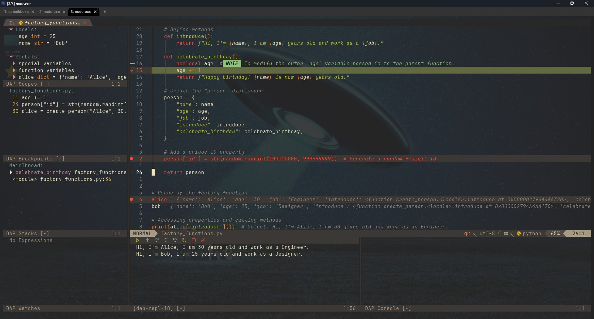

###### <u style="display:block;text-align:center">Inspired by the 💤[LazyVim](https://github.com/LazyVim/LazyVim) neovim distro, by folke</u>

**_NOTE:_** This is a <u>_passion project_</u> based in PowerShell. A work in progress that's ever
changing. There's plans to create a compatible setup for Unix environments.

**GOAL:** Improved project development workflow.

##### Use Cases: (_<u>Examples in Python</u>_)

- **Studying Algorithms**:
  
- **Image Previewer**: (Studying Algorithms w/ *MS Paint*🎨)
  
  **NOTE:** Image previewing **ONLY WORKS** in terminals that support the necessary image protocols,
  such as WezTerm, Kitty, or other compatible terminal emulators. This will <u>**NOT**</u> work in PowerShell, Command Prompt,
  or basic terminal emulators that lack support for those protocols.

- Debugging Software:
  
- Unit Testing: ??? (Coming Soon)

##### Language Feature Support:

| Language   | Debugging       | LSP Support | TreeSitter Highlights | Linting  | Format On Save | Auto-Complete | Unit Testing |
| ---------- | --------------- | ----------- | --------------------- | -------- | -------------- | ------------- | ------------ |
| MarkDown   | &#x274C;        | &#x2611;    | &#x2611;              | &#x2611; | &#x2611;       | &#x2611;      | &#x274C;     |
| Python     | &#x2611;        | &#x2611;    | &#x2611;              | &#x2611; | &#x2611;       | &#x2611;      | ?            |
| Lua        | Kind of &#8709; | &#x2611;    | &#x2611;              | &#x2611; | &#x2611;       | &#x2611;      | ?            |
| Java       | &#x2611;        | &#x2611;    | &#x2611;              | &#x2611; | &#x2611;       | &#x2611;      | ?            |
| Golang     | &#x2611;        | &#x2611;    | &#x2611;              | &#x2611; | &#x2611;       | &#x2611;      | ?            |
| JavaScript | &#x2611;        | &#x2611;    | &#x2611;              | &#x2611; | &#x2611;       | &#x2611;      | ?            |
| TypeScript | &#x2611;        | &#x2611;    | &#x2611;              | &#x2611; | &#x2611;       | &#x2611;      | ?            |
| C#         | &#x2611;        | &#x2611;    | &#x2611;              | &#x2611; | &#x2611;       | &#x2611;      | ?            |
| C++        | &#x2611;        | &#x2611;    | &#x2611;              | &#x2611; | &#x2611;       | &#x2611;      | ?            |
| PowerShell | &#x274C;        | &#x2611;    | &#x2611;              | &#x2611; | &#x2611;       | &#x2611;      | &#x274C;     |

#### Setup:

This setup does require some knowledge of powershell profiles for correctly setting environment variables (_<u>used during open
powershell sessions</u>_), or you could just set them within the global table on windows.

##### Environment Variables

This config is instended to demonstrate that it's possible to have multiple language support within neovim. In order for these languages
to work as intended, there are a few pre-requisites that need to be in place prior to utilisation.

| Variable                        | Description                                           | Why? |
| ------------------------------- | ----------------------------------------------------- | ---- |
| `JAVA_HOME`                     | Path to Java installation directory.                  |      |
| `DOTNET_ROOT`                   | .NET SDK root directory.                              |      |
| `CMAKE_EXPORT_COMPILE_COMMANDS` | Specifies default CMake generator.                    |      |
| `CMAKE_BUILD_TYPE`              | Specifies build type for CMake (e.g., Debug/Release). |      |

##### **Executables to add to the "$PATH" variable:**

Considering the scope and ambitious versatility of this configuration project, there's alot of programs that need to be
exposed to the Windows OS via either a powershell profile, or your global environment variables table accessible via the windows settings.
This allows for these programs to be used by plugins in neovim, allowing them to work as intended.

| Executable | Description                                                   | Why? |
| ---------- | ------------------------------------------------------------- | ---- |
| `python`   | Python interpreter.                                           |      |
| `py`       | Python Launcher.                                              |      |
| `pip`      | Python package manager.                                       |      |
| `lua`      | Lua interpreter.                                              |      |
| `luarocks` | Lua package manager.                                          |      |
| `java`     | Java runtime.                                                 |      |
| `javac`    | Java compiler.                                                |      |
| `mvn`      | Apache Maven (Java build tool).                               |      |
| `gradle`   | Gradle build tool.                                            |      |
| `node.js`  | Node.js runtime required for JavaScript support.              |      |
| `npm`      | Node.js package manager required for building _some_ plugins. |      |
| `npx`      | Node.js package runner.                                       |      |
| `tsc`      | TypeScript compiler (from npm).                               |      |
| `dotnet`   | .NET SDK CLI tool.                                            |      |
| `msbuild`  | Microsoft build system for .NET.                              |      |
| `g++`      | GNU C++ compiler.                                             |      |
| `clang++`  | Clang C++ compiler.                                           |      |
| `cmake`    | CMake build system.                                           |      |
| `make`     | Make build automation tool.                                   |      |
